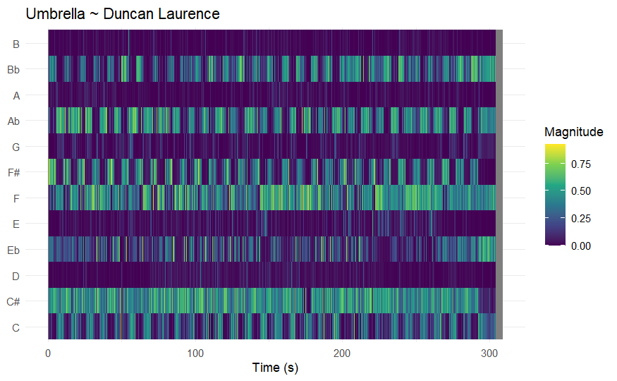
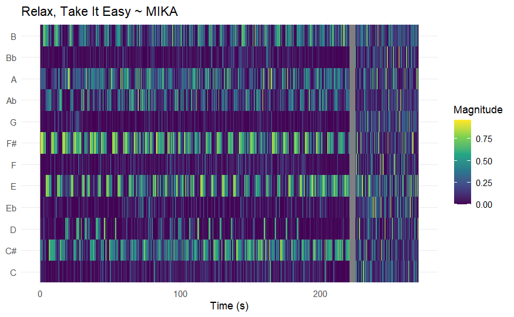
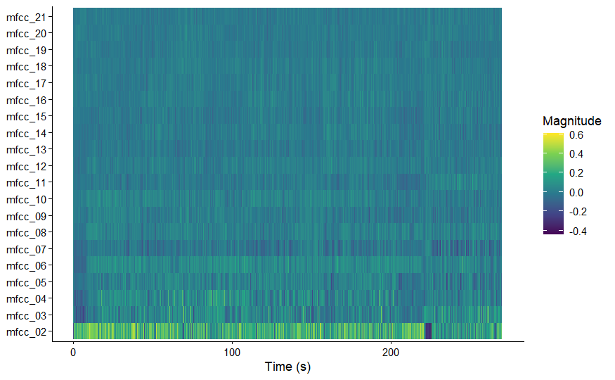
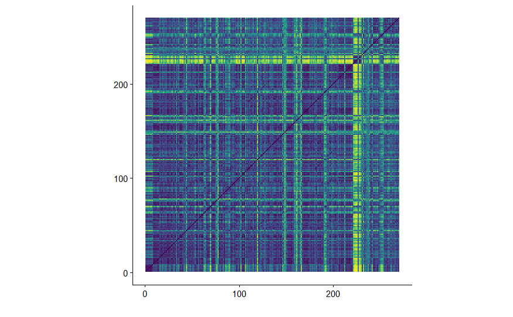

# Homework week 9 ~ Computational Musicology
*Mette Terpstra*

## Description of my project
I will analyze seasonal playlists I made over the years. My seasonal playlists are
summer and autumn with respectively 139 and 74 songs. I hypothesize that music I 
listen to in summer is happier, more danceable and has a faster tempo. Music in 
my autumn playlist will be slower and sadder. Furthermore, I will analyze what songs
Spotify recommends adding to these playlists. 

## Chromagram
Below is a chromagram for a song in my autumn playlist. It has mostly a C#, F and
Ab. Other than these pitches, F# and Bb are also frequent. I therefore conclude 
the song has the chords F# and C#, which are considered major chords. This is similar
to what I hear in the music. 

A song from my summer playlist is Relax, Take It Easy from MIKA. What immediately
catches the eye, is the grey gap in the chromagram. This is a silent moment in 
the music. After it, you can hear someone talk. The talking has keys from all the
pitches, while the music is very structured with frequent pitches such as F#, E 
and C#. 

## Cepstrogram

Here is my cepstrogram from Relax, Take It Easy. It looks for differences in timbre. 
As we already saw in the chromagram, there is a point of silence and after it a 
woman talking. We see these changes in the cepstrogram as well. For example in 
mfcc_02, there is a blue spot on 3/4 of the way. It occurs after the yellow lines.
The blue spot is the silence. After the blue spot, you can see what happens to the
cepstrogram when the woman is talking. There are no instruments you can hear when 
the woman is talking. 

## Self-similarity matrices

I made a self-similarity matrix from Relax, Take It Easy. The bright yellow means 
it is very different from the rest of the song. This is because there is a silence.
So again, the silence part and talking part after it can be seen. Other than that,
the structure of the song is:

- verse 1
- refrain
- bridge
- verse 2
- refrain (2 times)
- instrumental part
- refrain (2 times)
- bridge
- outro

I think, especially towards the end of the song, the dark blue parts is the refrain. 
This means that the refrain is very similar with the rest of the song. The yellow 
stripes in between are the instrumental parts between the refrains. I think this,
because the intro is also instrumental with the same melody and at the beginning
of my self-similarity matrix you can see a bit more yellow. 

